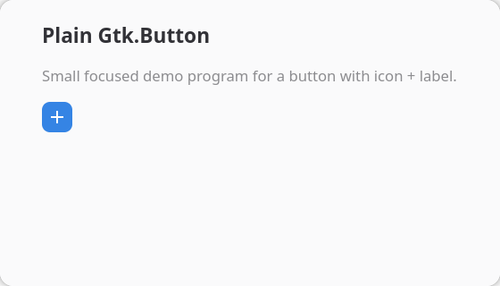
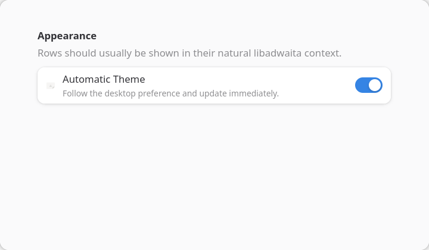
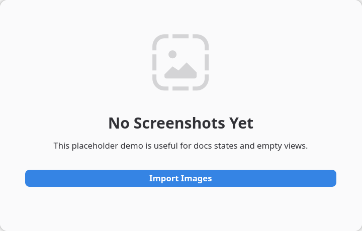

# Gallery

The visual side of the docs. This starts with screenshot-driven widget specimens and grows toward larger real application walkthroughs.

## GTK Widgets

### Gtk Button

Variant sheet covering common Gtk.Button properties and style classes.

- Slug: `gtk-button`
- Libraries: Gtk
- Source: [examples/widget_gallery/demos/gtk_button.py](https://github.com/jdahlin/ginext/blob/main/examples/widget_gallery/demos/gtk_button.py)

## Adwaita Widgets

### Adw Action Row

Preferences row with prefix icon and switch suffix.

- Slug: `adw-action-row`
- Libraries: Gtk, Adw
- Source: [examples/widget_gallery/demos/adw_action_row.py](https://github.com/jdahlin/ginext/blob/main/examples/widget_gallery/demos/adw_action_row.py)

### Adw Status Page

Empty-state layout with a primary call to action.

- Slug: `adw-status-page`
- Libraries: Gtk, Adw
- Source: [examples/widget_gallery/demos/adw_status_page.py](https://github.com/jdahlin/ginext/blob/main/examples/widget_gallery/demos/adw_status_page.py)
